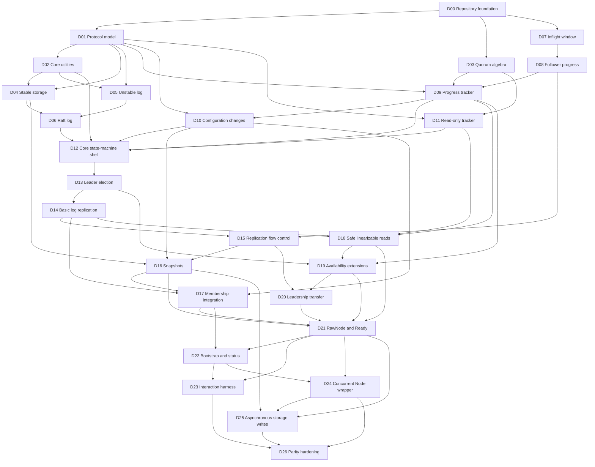

# Implementation DAG

## Execution rule

The table in this document is authoritative. A work package may start only
after all listed dependencies are complete. "Complete" means:

1. production code for the package is implemented;
2. focused translated tests pass;
3. public or cross-component behavior is documented;
4. no placeholder behavior is left for a listed acceptance gate.

Although several nodes become ready at the same time, implementation remains
sequential. The selected stable topological order is ascending node ID.

## Dependency graph



The graph contains 27 nodes and 58 dependency edges. Every edge points from a
lower selected-order node to a higher selected-order node, so the sequence
below is a valid topological sort.

## Selected topological order

```text
D00 -> D01 -> D02 -> D03 -> D04 -> D05 -> D06 -> D07 -> D08
    -> D09 -> D10 -> D11 -> D12 -> D13 -> D14 -> D15 -> D16
    -> D17 -> D18 -> D19 -> D20 -> D21 -> D22 -> D23 -> D24
    -> D25 -> D26
```

## Work packages

| ID | Work package and output | Depends on | Primary reference | Acceptance gate |
|---|---|---|---|---|
| D00 | Create the `net10.0` solution, production and test projects, build settings, repository metadata, Apache-2.0 license, and source attribution. | None | Repository layout, `LICENSE` | Restore, build, and an empty test run succeed. |
| D01 | Generate C# protocol types for entries, messages, hard state, snapshots, and configuration changes from the Raft protobuf schema. Add null-safety and equivalence helpers. | D00 | `raftpb/raft.proto`, `raftpb/*.go` | Proto round trips, optional-field presence, cloning, and `ConfState` equivalence tests pass. |
| D02 | Add shared errors, entry identifiers, validated log slices, message classification, encoded-size limiting, logging abstraction, and immutable-copy helpers. | D01 | `types.go`, `util.go`, `logger.go` | Utility and log-slice invariant tests pass. |
| D03 | Implement majority and joint-quorum vote results and committed-index calculation. | D00 | `quorum/*.go` | Ported quorum table, data-driven, and property tests pass. |
| D04 | Implement `IStorage` and thread-safe `MemoryStorage`, including append, term lookup, compaction, snapshot creation, and snapshot application. | D01, D02 | `storage.go` | Ported storage tests pass, including compaction and overlap cases. |
| D05 | Implement the unstable entry/snapshot buffer and persistence-in-progress lifecycle. | D01, D02 | `log_unstable.go` | Ported unstable-log truncation, restore, and stabilization tests pass. |
| D06 | Implement the unified Raft log, stable/unstable slicing, conflict detection, commit/apply cursors, and current-term commit check. | D04, D05 | `log.go`, `types.go` | Ported log tests pass and all cursor invariants are asserted. |
| D07 | Implement the count- and byte-bounded inflight append ring buffer. | D00 | `tracker/inflights.go` | Ported inflight growth, wraparound, freeing, and fullness tests pass. |
| D08 | Implement follower progress states and transitions: probe, replicate, and snapshot. | D07 | `tracker/progress.go`, `tracker/state.go` | Ported progress transition and rejection tests pass. |
| D09 | Implement voter/learner configuration tracking, vote tallying, quorum activity, and quorum-derived commit indexes. | D01, D03, D08 | `tracker/tracker.go` | Tracker votes, commit, learner, and activity tests pass. |
| D10 | Implement simple membership changes, joint consensus, restore from `ConfState`, and configuration invariants. | D01, D09 | `confchange/*.go` | Ported data-driven, quick/property, and restore tests pass. |
| D11 | Implement read-only request tracking and quorum acknowledgement for safe reads. | D01, D03 | `read_only.go` | Requests advance only after the required majority or joint majority acknowledges them. |
| D12 | Implement `RaftConfig`, validation, core state fields, initialization, logical clocks, role transitions, and outbound message queues. | D02, D06, D09, D10, D11 | `raft.go` initialization and state sections | Invalid configurations fail explicitly; nodes initialize as followers with restored state and configuration. |
| D13 | Implement randomized election timeouts, campaigning, vote requests/responses, term handling, and follower/candidate/leader transitions. | D12 | `raft.go`, election sections of `raft_paper_test.go` | Paper election scenarios pass, including one vote per term and log freshness. |
| D14 | Implement leader no-op entries, proposals, append/heartbeat handling, log matching, follower acknowledgement, and quorum commit. | D13 | `raft.go`, replication sections of `raft_paper_test.go` and `raft_test.go` | A deterministic three-node cluster elects a leader and commits a proposal; current-term commit safety tests pass. |
| D15 | Add optimistic replication, append rejection hints, probe recovery, message-size limits, inflight flow control, unreachable reporting, and uncommitted-size limits. | D08, D14 | `design.md`, `raft_flow_control_test.go`, progress-related interaction files | Probe/replicate transitions, pause recovery, and bounded inflight behavior match the reference. |
| D16 | Add snapshot sending, receiving, restoring, reporting, and compacted-follower recovery. | D04, D10, D15 | `raft_snap_test.go`, snapshot interaction files | Obsolete snapshots are ignored; valid snapshots restore log/configuration and resume replication. |
| D17 | Integrate membership changes into the core, including pending-change protection, learners, joint consensus, auto-leave, and leader removal. | D10, D14, D16 | Membership sections of `raft.go`, `testdata/confchange_*` | V1 and V2 membership scenarios pass without violating quorum or learner invariants. |
| D18 | Implement safe `ReadIndex`, heartbeat contexts, follower forwarding, and pending reads awaiting a current-term commit. | D09, D11, D14 | `read_only.go`, read-index sections of `raft_test.go` | Safe linearizable read indexes are released only after quorum confirmation. |
| D19 | Implement `CheckQuorum`, `PreVote`, `ForgetLeader`, and lease-based `ReadIndex`. Lease mode requires `CheckQuorum` and assumes bounded clock drift. | D09, D13, D18 | `testdata/checkquorum.txt`, `prevote*.txt`, `forget_leader*.txt`, lease-read sections of `raft_test.go` | Isolated nodes do not unnecessarily disrupt an active leader, and lease reads cannot be enabled without their safety prerequisite. |
| D20 | Implement leadership transfer, `TimeoutNow`, transfer cancellation, and proposal rejection during transfer. | D15, D19 | Leadership-transfer sections of `raft.go` and `raft_test.go` | Transfer succeeds only to an eligible caught-up voter and times out safely. |
| D21 | Implement `RawNode`, synchronous `Ready`/`Advance`, `HasReady`, `MustSync`, storage/apply acknowledgements, and reporting methods. | D16, D17, D18, D19, D20 | `rawnode.go`, `rawnode_test.go` | Persistence-before-response ordering and ordered synchronous Ready/Advance processing match the reference. |
| D22 | Implement bootstrap, restart, status snapshots, message/entry descriptions, and tracing hooks. | D17, D21 | `bootstrap.go`, `status.go`, `util.go`, `state_trace*.go` | Bootstrap/restart and status tests pass without exposing mutable internal state. |
| D23 | Port the deterministic interaction environment, message queue, partitions, compaction controls, storage processing, and golden scenario runner. | D21, D22 | `rafttest/interaction_env*`, `interaction_test.go`, `testdata/*` | Supported golden scenarios produce stable expected output. |
| D24 | Implement the concurrent `Node` wrapper with serialized commands, ticks, cancellation, lifecycle, and Ready delivery. | D21, D22 | `node.go`, `node_test.go` | Node API tests pass without changing core deterministic behavior. |
| D25 | Implement asynchronous append/apply storage messages, pipelining, completion responses that replace `Advance`, and ABA protection. | D16, D21, D24 | Async sections of `rawnode.go`, `testdata/async_storage_writes*.txt` | Async storage scenarios preserve durability ordering and unstable-log correctness without calling `Advance`. |
| D26 | Close the parity matrix: port remaining relevant tests, add deterministic fuzz/property coverage, document public APIs, configure compliant NuGet packaging with license and attribution files, and establish focused performance baselines. | D23, D24, D25 | Full reference test suite | All declared features have passing tests, no undocumented parity gaps remain, and the package contains its required license and attribution metadata. |

## Milestones

| Milestone | Nodes | Observable result |
|---|---|---|
| M1: Foundations | D00-D03 | Buildable repository with protocol types and independently verified quorum math. |
| M2: Log substrate | D04-D11 | Stable/unstable log, replication tracking, membership algebra, and read tracking are independently correct. |
| M3: Election model | D12-D13 | A deterministic node can time out, campaign, vote, and elect a leader. |
| M4: Replicated log | D14-D15 | A deterministic cluster can replicate and commit proposals with bounded flow control. |
| M5: Full core semantics | D16-D20 | Snapshots, membership, linearizable reads, availability extensions, and leadership transfer work. |
| M6: Public integration | D21-D25 | `RawNode`, host-facing `Node`, interaction harness, and asynchronous storage behavior are available. |
| M7: Parity release | D26 | The declared `etcd/raft` feature matrix is complete and documented. |

The first learning milestone that demonstrates the Raft algorithm is **M4**.
The first host-consumable library milestone is **M6**.

## Change control

- Adding an implementation feature requires adding or extending a DAG node and
  its acceptance gate before coding.
- If a new dependency points backward in the selected order, the graph must be
  revalidated and this document updated.
- A node may be split when its acceptance gate becomes too broad, but completed
  predecessors must not be reopened without a documented defect or ADR.
