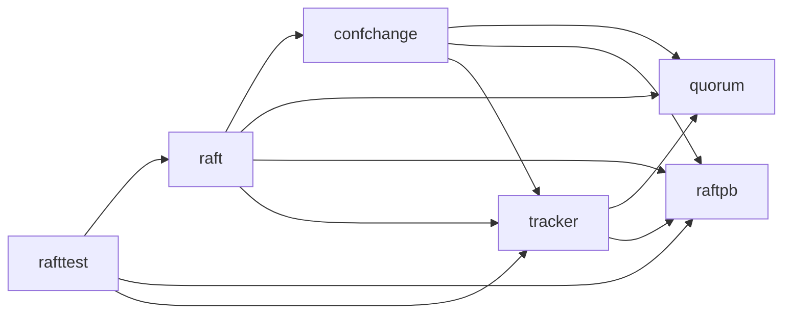
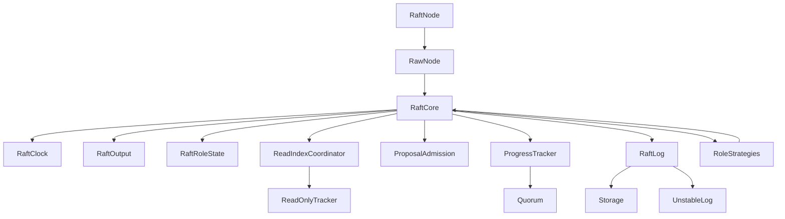

# Reference Architecture

## Reference snapshot

The analysis is based on `etcd-io/raft` commit
`1c0011d2c6b7a0230f87bad38ad4c6e70d810f9e`. The module contains six internal
packages:



`raftpb` and `quorum` are leaves. `tracker` builds on both.
`confchange` builds on `tracker`. The root `raft` package composes every
algorithmic component, and `rafttest` is an external black-box harness.

## Architectural boundary

The reference library deliberately excludes network and disk I/O. Its core can
be modeled as:

```text
current state + Message/Tick
              |
              v
       deterministic Raft step
              |
              v
Ready {
  state to persist,
  entries to persist,
  messages to send,
  entries to apply
}
              |
              v
application persists, sends, and applies
              |
              v
Advance / local storage response
```

This boundary is the most important design choice to preserve. A message may
represent a remote RPC, a local timer event, a proposal, or completion of local
storage work. The core performs no blocking I/O.

## Component map

| Component | Reference files | Responsibility | Direct logical dependencies |
|---|---|---|---|
| Protocol model | `raftpb/raft.proto`, `raftpb/*.go` | Entries, messages, hard state, snapshots, and membership-change payloads | None |
| Quorum algebra | `quorum/*.go` | Majority and joint-quorum vote and commit calculations | Node identifiers and indexes |
| Replication tracking | `tracker/*.go` | Per-follower progress, inflight windows, voters, learners, votes, and committed index | Protocol model, quorum algebra |
| Configuration changes | `confchange/*.go` | Simple changes, joint consensus, restore, and invariant validation | Protocol model, quorum algebra, tracker |
| Stable storage | `storage.go` | Storage contract and in-memory implementation | Protocol model |
| Unstable log | `log_unstable.go` | Entries and snapshots not yet known to be durable | Protocol model |
| Unified Raft log | `log.go`, `types.go` | Stable/unstable merged view, conflict detection, slicing, commit, and apply cursors | Storage, unstable log, protocol model |
| Read-only tracking | `read_only.go` | Quorum confirmation for linearizable reads | Protocol model, quorum algebra |
| Core state machine | `raft.go` | Terms, roles, ticks, elections, replication, commits, snapshots, membership, and extensions | Every algorithmic component |
| Deterministic API | `rawnode.go`, `bootstrap.go` | `Step`, `Tick`, `Ready`, `Advance`, bootstrap, and reporting APIs | Core state machine |
| Concurrent API | `node.go` | Channel-based serialization and lifecycle around `RawNode` | Deterministic API |
| Status and diagnostics | `status.go`, `util.go`, `state_trace*.go`, `logger.go` | Inspection, formatting, logging, and tracing | Core and tracker |
| External test harness | `rafttest/*`, `interaction_test.go`, `testdata/*` | Message delivery, partitions, storage processing, and golden interaction scenarios | Public Raft API |

## Implemented C# core boundaries

The C# implementation preserves the reference package boundary while
decomposing mutable core ownership:



| C# component | Authoritative responsibility |
|---|---|
| `RaftCore` | Cross-component sequencing, term routing, coordinated reset, log mutation, commit/read ordering, membership orchestration, async storage responses, tracing, and logging |
| `RaftClock` | Election/heartbeat elapsed values, configured ticks, randomized timeout, and overflow-safe tick/reset behavior |
| `RaftOutput` | Immediate and after-append queues, outbound cloning, sender/term normalization, and queue classification |
| `RaftRoleState` | Term, vote, leader ID, role, and leadership transferee |
| `ReadIndexCoordinator` | `ReadOnlyTracker`, gated reads, quorum advancement, and completed `ReadState` output |
| `ProposalAdmission` | Uncommitted payload accounting and pending configuration index |
| `ProgressTracker` | Installed configuration/progress maps, votes, quorum-derived commit, and voter/learner queries |
| Role strategies | Stateless follower, pre-candidate, candidate, and leader message routing resolved from the authoritative role on every dispatch |

Only role strategies reference `RaftCore`, through explicit internal handler
methods. Other collaborators never reference the aggregate. Mutable component
state has one owner; tests use component fixtures or explicit `ForTesting`
hooks rather than writable forwarding properties.

## Core state

The root `raft` object combines five categories of state:

1. **Persistent consensus state:** current term, vote, and committed index.
2. **Log state:** stable storage, unstable entries, committed/applying/applied
   cursors, and an optional snapshot.
3. **Role state:** follower, pre-candidate, candidate, or leader; current
   leader; election and heartbeat counters.
4. **Leader replication state:** a `Progress` object for each voter or learner,
   including `Match`, `Next`, mode, and inflight append messages.
5. **Extension state:** pending membership changes, read-index requests,
   leadership transfer, quorum activity, and storage-work completion.

Role-specific behavior is selected through a state-specific step function:

- follower: forward proposals, receive append/heartbeat/snapshot messages;
- candidate or pre-candidate: collect votes and step down for a valid leader;
- leader: append proposals, replicate entries, advance commit, and manage
  follower progress.

## Important invariants

The C# port must make these invariants explicit and test them close to the
component that owns them.

### Log invariants

- Log indexes are contiguous.
- Terms never decrease within a log.
- A committed entry is never overwritten.
- `applied <= applying <= committed <= lastIndex`.
- Stable and unstable log ranges form one coherent logical log.
- A leader commits an index through quorum acknowledgement only when the entry
  at that index belongs to the leader's current term.

### Election invariants

- Terms increase monotonically.
- A node grants at most one real vote per term.
- A candidate's log must be at least as up to date as the voter's log.
- A candidate or leader receiving a valid higher-term message becomes a
  follower, except that `MsgPreVote` and granted `MsgPreVoteResp` messages do
  not advance the local term. A rejected higher-term pre-vote response follows
  the normal higher-term transition.
- Election timeouts are logical ticks and are randomized in
  `[ElectionTick, 2 * ElectionTick)`.

### Replication invariants

- For each follower, `0 <= Match < Next`.
- `Match` never decreases.
- Probe mode has at most one effective append in flight.
- Replicate mode may optimistically advance `Next`, bounded by inflight limits.
- Snapshot mode pauses append replication.
- Append rejection handling never moves `Next` below `Match + 1`.

### Persistence invariants

- Term and vote changes are durable before a granted vote response is sent.
- New log entries are durable before an append acknowledgement is sent.
- `Ready` batches are observed and advanced in order.
- Entries, hard state, snapshots, messages, and applied entries retain the
  ordering contract documented by `Ready`.

### Membership invariants

- Every voter or learner has a corresponding progress record.
- Active learners and voters are disjoint.
- Joint consensus requires a majority of both incoming and outgoing voter
  sets.
- Configuration changes become active when applied, not merely appended.
- At most one unapplied configuration change is accepted at a time.

## Test architecture

The reference tests form a layered specification:

| Layer | Representative sources | What it specifies |
|---|---|---|
| Leaf units | `quorum/*_test.go`, `tracker/*_test.go`, `storage_test.go`, `log_unstable_test.go`, `log_test.go` | Local data structures and invariants |
| Paper scenarios | `raft_paper_test.go` | Elections, log matching, commitment, and safety rules from the Raft paper |
| Core behavior | `raft_test.go`, `raft_snap_test.go`, `raft_flow_control_test.go` | Full state-machine behavior and extensions |
| API contract | `rawnode_test.go`, `node_test.go` | `Ready`/`Advance`, persistence ordering, and concurrent wrapper behavior |
| Golden interactions | `interaction_test.go`, `testdata/*.txt` | Multi-step cluster scenarios, membership changes, snapshots, pre-vote, and async storage |
| End-to-end harness | `rafttest/network.go`, `rafttest/node.go` | Message loss, delay, disconnect, restart, and application integration |

Tests will be translated with the DAG node that first owns the behavior. The
golden interaction harness is intentionally late because it depends on the
public deterministic API.

## Porting implications

- Go files are not C# module boundaries. Several root-package concerns must be
  separated into implementation capabilities before they are recomposed.
- `RawNode` is the semantic center of the public API. The concurrent `Node`
  wrapper is an adapter, not the algorithm.
- Storage and message durability ordering are part of Raft safety, not merely
  host plumbing.
- Advanced features must not be mixed into the first election and replication
  milestone, but their dependencies must be anticipated so the core is not
  rewritten later.
